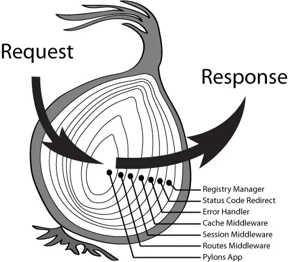

# 中间件

koa 中间件学习使用

### 使用

koa 本身是对 http 做的一层封装，而各个功能的实现则主要通过中间件来实现。

koa 的每个中间件接收两个参数，第一个是`context`参数，第二个是`next`函数，在中间件中调用`next`函数时，当前中间件就会把执行权交给下一个中间件，等待下一个中间件返回后继续执行；如果没有调用`next`函数，就不会调用下一个中间件。

中间件的加载顺序是根据代码运行时执行`app.use`的顺序加载，最后形成一个`洋葱型`的中间件模型



```javascript
const Koa = require("koa");
const app = new Koa();

app.use(async (ctx, next) => {
  console.log(1);
  await next(); // 将执行权交给下一个中间件
  console.log(2);
});

app.use(async (ctx, next) => {
  console.log(3);
  await next(); // 将执行权交给下一个中间件，没有则继续向下执行
  console.log(4);
});

app.listen(3000);

// 1
// 3
// 4
// 2
```

### 原理分析

查看 koa 的源码`application.js`文件，分析一下当中关于中间件的处理，主要就是以下代码：

```javascript
const compose = require("koa-compose");

module.export = class Application extends Emitter {
  constructor() {
    super();
    this.middleware = []; // 定义一个middleware数组用来存储中间件
  }

  use(fn) {
    this.middleware.push(fn); // 通过use方法将中间件一次push到middleware数组中去
    return this;
  }

  callback() {
    const fn = compose(this.middleware); // 组合中间件，返回一个函数
    return function (req, res) {
      return fn(crx);
    };
  }
  listen(...args) {
    const server = http.createServer(this.callback());
    return server.listen(...args);
  }
};
```

根据上面的代码可以看出，中间件框架的核心就是这个组合中间件的`compose`函数，`compose`函数是定义在`koa-compose`这个库里面的，所以需要看`koa-compose`的源码，先上代码：

```javascript
function compose(middleware) {
// 判断middleware以及里面中间件的类型，出错则结束
  if (!Array.isArray(middleware))
    throw new TypeError("Middleware stack must be an array!");
  for (const fn of middleware) {
    if (typeof fn !== "function")
      throw new TypeError("Middleware must be composed of functions!");
  }
  return function (context, next) {
    let index = -1;
    return dispatch(0);
    function dispatch(i) {
      if (i <= index)
        return Promise.reject(new Error("next() called multiple times"));
      index = i;
      let fn = middleware[i]; --> A
      if (i === middleware.length) fn = next;
      if (!fn) return Promise.resolve();
      try {
        return Promise.resolve(fn(context, dispatch.bind(null, i + 1))); --> B
      } catch (err) {
        return Promise.reject(err);
      }
    }
  };
}
```

`compose`函数返回一个新的函数，在这个新的函数中，构造并循环调用一个`dispatch`函数。

在`dispatch`函数中，在代码行 A 中每次从中间件数组中取出一个中间件`fn`，并在代码行 B 返回一个`Promise`对象。

- 当调用`dispatch(0)`时，代码行 B 的执行中间件的时候传入两个参数，第一个就是`context`上下文对象，第二个是`dispatch(1)`函数的返回
- `diapatch(1)`的返回就是下一个中间件的执行结果，也就是中间件中`next`函数的执行，就实现了将执行权交给下一个中间的效果，当下一个中间件执行结束了之后，当前中间件才会继续向下执行
- 而`dispatch(1)`调用的结果又依赖下一个`diapatch`的调用
- 这样循环调用之后，形成上面图示的那种`洋葱模型`，就可以实现从`compose([f1, f2, ..., fn])`到`f1(f2(...fn(noop())))`的转换，最终执行的就是`f1(f2(...fn(noop())))`这样一个函数
